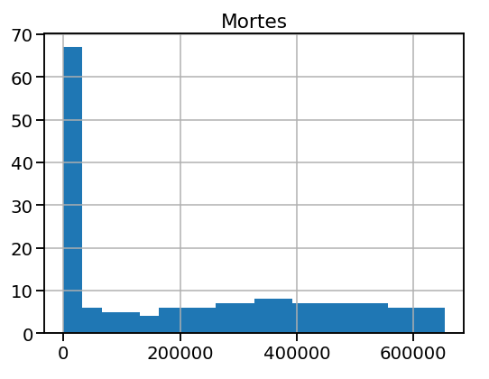
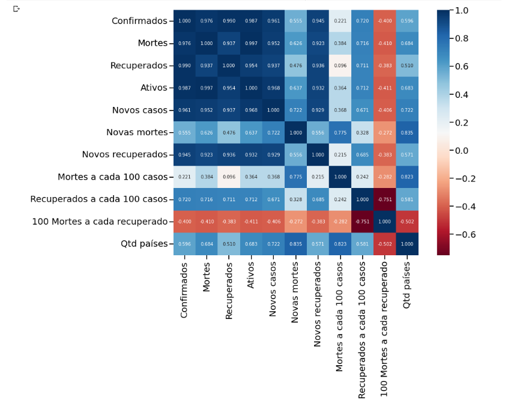
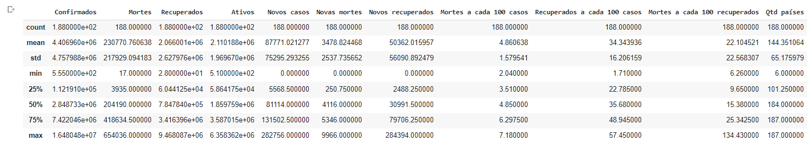

# Introdução


 Análise Exploratória de Dados usando um data set do Kaggle sobre o período inicial de COVID-19. A partir da análise fiz edições na tabela , observei padrões e deduzi resultados no Google Colaboratory.
 
 # Instalação
 
```import pandas as pd```


```import numpy as np```


```import seaborn as sns```


```import matplotlib```


```import matplotlib.pyplot as plt```
 
# Exemplos

O gráfico abaixo monstra a curva de crescimento em relação ao tempo do número de pacientes com covid que faleceram 

 
 
Gráfico representando a correlação entre as variáveis, que identificam tendências em variação das variáveis

 
 
Tabela a qual indica valores importantes como média, desvio padrão, máximo, mínimo e os quartis das variáveis 

 
 
# Conclusão
 
# Fontes

Link do arquivo do Kaggle:https://www.kaggle.com/datasets/imdevskp/corona-virus-report

Data Frame usado : day_wise
 
Google Colaboratory: https://colab.research.google.com/
