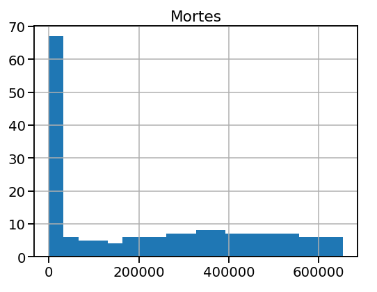
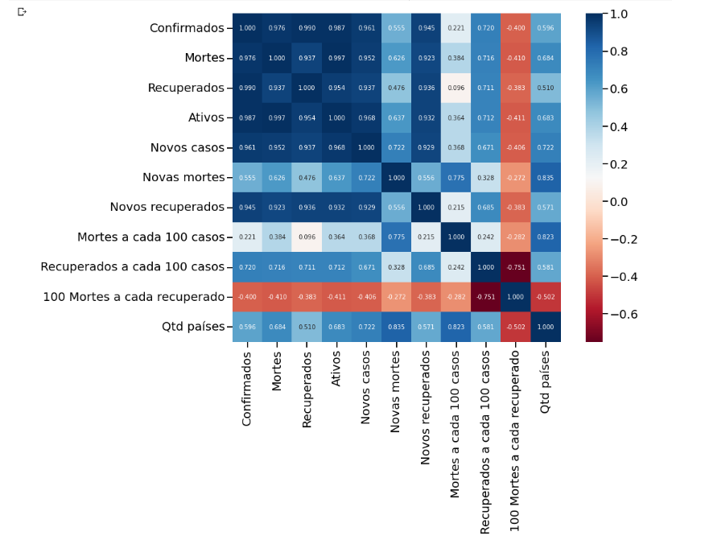
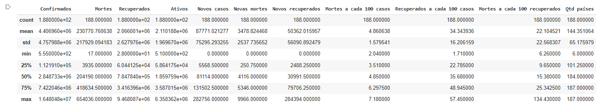

# Introdução


 Análise Exploratória de Dados usando um data set do Kaggle sobre o período inicial de COVID-19. A partir da análise fiz edições na tabela , observei padrões e deduzi resultados no Google Colaboratory.
 
 # Instalação
 
```import pandas as pd```
```import numpy as np```
```import seaborn as sns```
```import matplotlib```
```import matplotlib.pyplot as plt```
 
# Exemplos
 
 
 
 
 
 
 

Link do arquivo do Kaggle:https://www.kaggle.com/datasets/imdevskp/corona-virus-report

Data Frame usado : day_wise
 
Google Colaboratory: https://colab.research.google.com/
